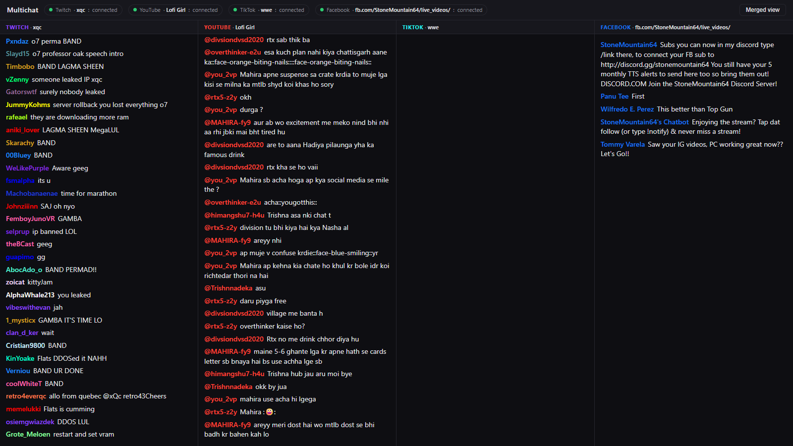

# Multichat

**One page that shows Twitch, YouTube, TikTok, and Facebook live chat at the same time.**

Built for streamers who broadcast to several platforms at once: instead of juggling four chat tabs mid-stream, you (or your mod) open one page and see everything — either merged into a single feed or split into four columns.



- No accounts, API keys, or logins required for any platform (details below).
- One small Node server, one static HTML page. No framework, no build step.
- Channels are set in `config.json` only — there is deliberately **no channel UI** on the page, so the person viewing it can't misconfigure it.

## Quick start

```bash
npm install
npm start        # → http://localhost:3100
```

Edit `config.json` to point at your channels (see below), restart the server. Set `PORT` to serve on a different port.

The page defaults to the 4-column **split view**; the header button toggles a single **merged view**. The choice is remembered per browser. Header pills show live connection state per platform (`connected` / `waiting for live` / `reconnecting`).

## How it works

```
Twitch (tmi.js, anon IRC) ─────┐
YouTube (youtube-chat scrape) ─┤    normalize to                 browser
TikTok (tiktok-live-connector) ├─→ {platform, user, text} ─→ one WebSocket ─→ index.html
Facebook (headless Playwright) ┘    + recent history replayed on connect
```

`server.js` is the whole backend: Express serves `public/`, a `ws` WebSocketServer fans every chat message out to all connected pages, and four independent connectors feed it. Each connector self-reconnects and can never take the process down (global uncaught-error guards). A new page load gets recent history replayed so it isn't empty — buffered per platform (80 each), so a firehose Twitch chat can't evict the slower platforms' messages.

`public/index.html` is the whole frontend. Messages are queued and rendered **once per animation frame** in batches, so a firehose chat (a big Twitch stream easily does 10+ msgs/sec) doesn't lag the page. DOM is capped (250 nodes merged / 150 per column); each feed auto-scrolls unless you scroll up, with a "jump to latest" pill.

### Per-platform connectors

| Platform | How | Auth needed | Notes |
|---|---|---|---|
| Twitch | `tmi.js` anonymous IRC | none | Works whether or not the channel is live (chat exists regardless) |
| YouTube | `youtube-chat` scrape by `channelId` | none | Auto-attaches to the channel's *current* live; retries every 60s if not live |
| TikTok | `tiktok-live-connector` v2 | none | Connects only while the user is live; retries every 60s |
| Facebook | headless Playwright on the page's public `/live_videos/` listing | **none** | See below — this is the unusual one |

### Facebook without a login or token

Facebook's Graph API needs a Page access token, and normal scraping needs a logged-in session — both are bad for a hosted deployment. The trick this app uses: **a page's public `/live_videos/` listing renders a preview of the newest ~5 comments on the current live even when logged out.** So the connector:

1. Launches a headless browser (Edge → Chrome → Playwright Chromium, first one found) on `facebook.com/<page>/live_videos/`.
2. A `MutationObserver` injected into the page extracts comment blocks (`[role="article"]`), taking only *leaf* `dir="auto"` text nodes (nested wrappers duplicate text) and stripping relative timestamps.
3. Reloads the page every 45 seconds; a server-side dedupe set (`name|text`, capped at 800) means only genuinely new comments are relayed.
4. Health is judged by message flow, not page text: a 15-minute silent stretch triggers a full browser restart.

**Tradeoffs:** up to ~1 minute of latency, and only the newest handful of comments per cycle — a very busy chat will have gaps. (For comparison, Facebook's official live-comments stream is itself rate-limited to one comment per 2 seconds.) If you *do* have a Page token, set `pageId` + `accessToken` instead and the server uses the Graph API SSE stream directly — leave `liveUrl` empty to enable that path.

## Config reference — `config.json`

```jsonc
{
  "twitch":  { "channel": "xqc" },              // channel login name (the part after twitch.tv/)
  "youtube": {
    "channelId": "UCSJ4gkVC6NrvII8umztf0Ow",    // preferred: auto-attaches to that channel's current live
    "videoId": ""                               // or pin one specific live video id
  },
  "tiktok":  { "username": "wwe" },             // @name without the @
  "facebook": {
    "liveUrl": "https://www.facebook.com/StoneMountain64/live_videos/",
                                                // any page's /live_videos/ URL — the no-auth scrape mode
    "pageId": "",                               // OR: Graph API mode — page id +
    "accessToken": "",                          //     Page token (pages_read_engagement + pages_read_user_content)
    "liveVideoId": "",                          // optional: pin one broadcast instead of auto-detecting
    "socialStreamSession": ""                   // OR: Social Stream Ninja session id (browser-extension relay)
  }
}
```

Facebook mode priority: `liveUrl` → Graph API (`accessToken` + `pageId`/`liveVideoId`) → Social Stream Ninja. Empty values disable a platform (its pill shows `off`).

## Production deploy

- **Node 18+** (uses global `fetch`).
- The Facebook scraper needs a Chromium-family browser on the host. It tries Edge, then Chrome, then Playwright's own build. On a fresh Linux box: install Chrome, or run `npx playwright@1.62 install --with-deps chromium`. `FB_BROWSER_CHANNEL=chrome` forces a specific one.
- Keep it alive with pm2 (`pm2 start server.js --name multichat`) or systemd. Connectors self-reconnect; errors are logged, not fatal.
- Put nginx/Caddy in front for HTTPS. The WebSocket shares the HTTP port, so a plain `proxy_pass` with `Upgrade`/`Connection` headers is all that's needed.
- `fb-profile/` is the scraper's browser profile dir, created at runtime — it's gitignored and safe to delete.

## Helper / diagnostic scripts

All standalone, run with `node <script>`:

| Script | What it tells you |
|---|---|
| `wscheck.js` | 25s per-platform relayed-message counts (server must be running) |
| `fbwatch.js [secs]` | prints Facebook messages as the server relays them |
| `fbdiscover.js` | lists pages live **right now** on Facebook Gaming — works logged out; handy for picking a demo channel |
| `fbprobe-live.js <page>…` | is a FB page live, and how many preview comments render |
| `ttprobe.js <user>…` | is a TikTok user live (`fetchIsLive`) |
| `ttconnect.js <user>…` | real TikTok chat connection test with 20s message count ("Failed to retrieve Room ID" = they're offline) |
| `fbmock.js` + `FB_STREAM_URL` env | mock Graph SSE stream for testing the Graph path offline |
| `fblogin.js` | one-time interactive FB login into `fb-profile/` — **not needed** for the scrape mode, kept for edge cases |
| `shot.js [file.png]` | headless screenshot of the dashboard |

## Known limitations

- **Facebook**: preview-only scrape (see tradeoffs above); Facebook markup changes could break the extractor selectors — `fbwatch.js` is the quick way to verify it still flows.
- **TikTok**: chat only exists while the account is live; the server retries every 60s until then. Finding accounts that are live is manual (`ttconnect.js`) — TikTok's live directory is login-walled.
- **YouTube**: `youtube-chat` scrapes the watch page; a YouTube layout change could break it (lib is pinned).
- Messages are relayed raw — no profanity filtering or moderation. Emotes render as text (`:emote:` on YouTube).
- One config per server instance. Run multiple instances on different ports for multiple streamers.
